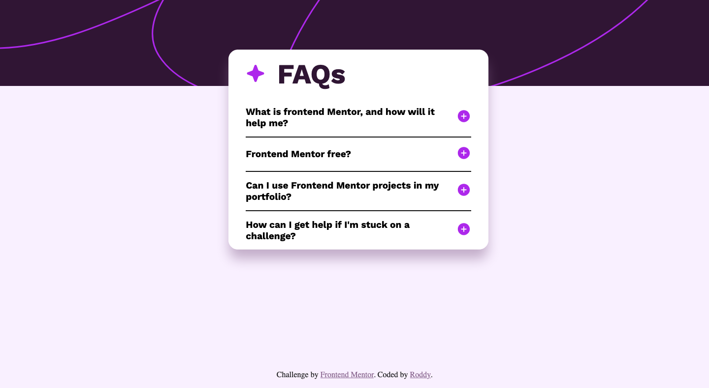
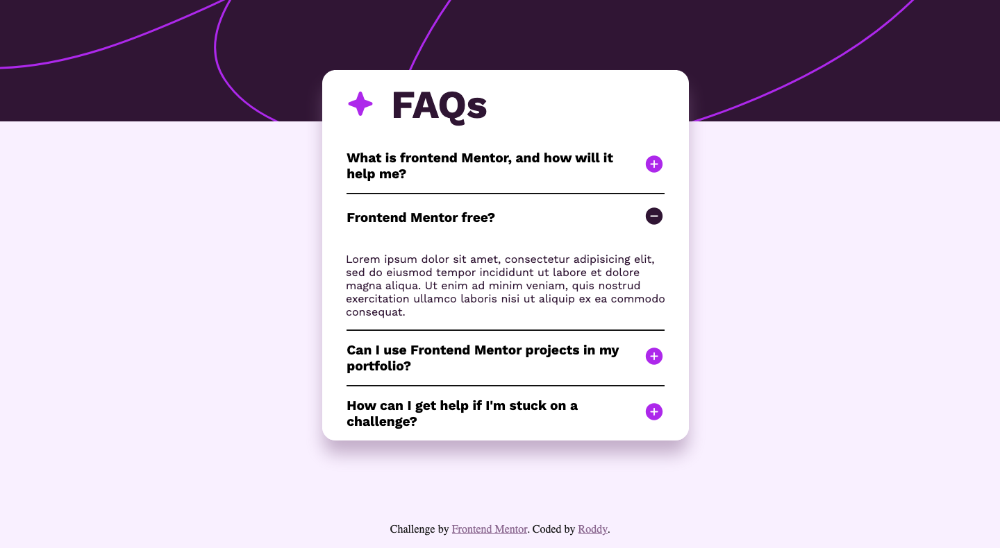

# Frontend Mentor - FAQ accordion solution

This is a solution to the [FAQ accordion challenge on Frontend Mentor](https://www.frontendmentor.io/challenges/faq-accordion-wyfFdeBwBz). Frontend Mentor challenges help you improve your coding skills by building realistic projects.

## Project overview

A simple CSS project to get into the flow of Front end mentor projects.
Used Principles learned from Kevin Powells CSS demystified course.

Please see screen shots to see the result of how it ran on my computer
under assets/screenshots

## Setup

To run this, you can clone this repo and run it on liveserver or some equivelent.
